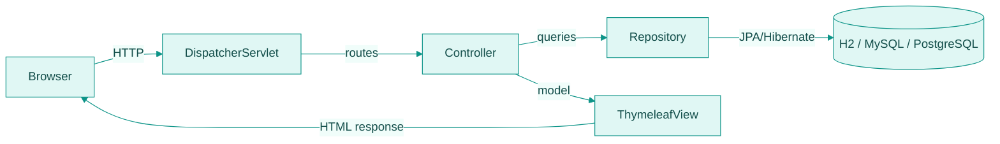
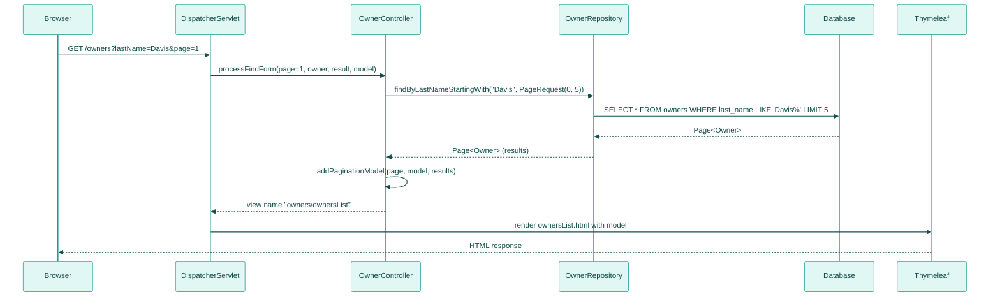
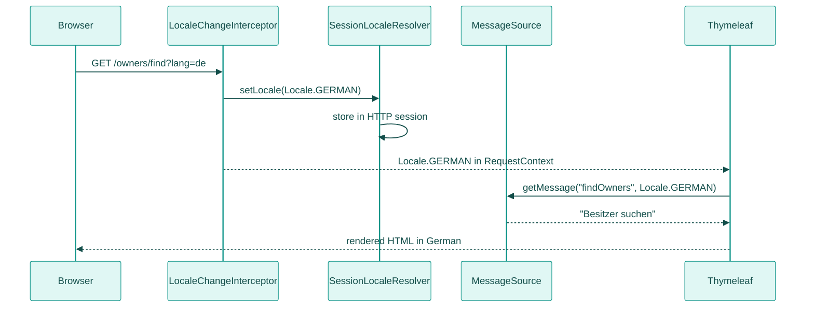

# Architecture

Spring PetClinic is a Spring MVC web application. This page traces how a request moves through the codebase, explains the caching subsystem, and describes how internationalization works at runtime.

## Layer overview

| Layer | Package | Responsibility |
|-------|---------|---------------|
| Controller | `org.springframework.samples.petclinic.owner`, `.vet`, `.system` | Handle HTTP requests, validate input, populate model |
| Repository | `OwnerRepository`, `VetRepository`, `PetTypeRepository` | Spring Data JPA interfaces; generate SQL from method signatures |
| JPA / Hibernate | Spring Boot auto-configured | Map entities to tables; manage sessions and transactions |
| View | `src/main/resources/templates/` | Thymeleaf HTML templates; resolve message keys for i18n |

## Request flow: owner search

A `GET /owners?lastName=Davis` request moves through these steps:

Key implementation points:
- **`OwnerController.processFindForm`** (`owner/OwnerController.java:94`) sets page size to 5 via `PageRequest.of(page - 1, 5)`.
- **`OwnerRepository.findByLastNameStartingWith`** generates a prefix-match query from the method name via Spring Data JPA.
- If exactly one owner matches, `OwnerController` redirects directly to `/owners/{ownerId}` without rendering the list.
- If no owners match, the `notFound` error code is added to `BindingResult` and the find form is re-rendered.

## Caching subsystem

`VetRepository.findAll()` is annotated `@Cacheable("vets")`. The cache named `vets` is created by `CacheConfiguration` using the JCache API with statistics enabled. Caffeine provides the underlying store (pulled in by `spring-boot-starter-cache` + Caffeine dependency).

The cache has no expiry policy configured — it persists for the lifetime of the application process. Cache statistics are accessible via JMX and through Spring Boot Actuator at `/actuator/metrics`.

## Internationalization subsystem

- **`WebConfiguration`** (`system/WebConfiguration.java`) declares `SessionLocaleResolver` (default: `Locale.ENGLISH`) and `LocaleChangeInterceptor` (parameter name: `lang`).
- **`MessageSource`** resolves keys from `src/main/resources/messages/messages_{locale}.properties`. Missing keys fall back to `messages.properties`.
- Thymeleaf templates use `#{key}` syntax. `I18nPropertiesSyncTest` enforces that all templates use message keys and that every locale file is complete.

## Form binding security

`OwnerController`, `PetController`, and `VisitController` each register a `WebDataBinder` that calls `setDisallowedFields("id", "*.id")`. This prevents a form submission from overwriting the entity `id` field directly, closing a mass-assignment vector at the framework level.

## Database schema initialization

On startup, Spring Boot runs `src/main/resources/db/{database}/schema.sql` then `data.sql`. The `database` placeholder is set by the active profile (`h2`, `mysql`, or `postgres`). Schemas are idempotent: H2 uses `DROP TABLE IF EXISTS`, MySQL/PostgreSQL use `DROP TABLE IF EXISTS` with separate user-setup scripts.

The `pets` table enforces `UNIQUE (owner_id, name)` at the database level (`schema.sql:55`). `PetController` catches `DataIntegrityViolationException` and translates it to a `duplicate` field error.

## See also

- [HTTP endpoints reference](../reference/endpoints) — all routes and their parameters
- [Domain model reference](../reference/domain-model) — entity fields, constraints, relationships
- [Change language](../guides/internationalization) — how to switch locale at runtime
