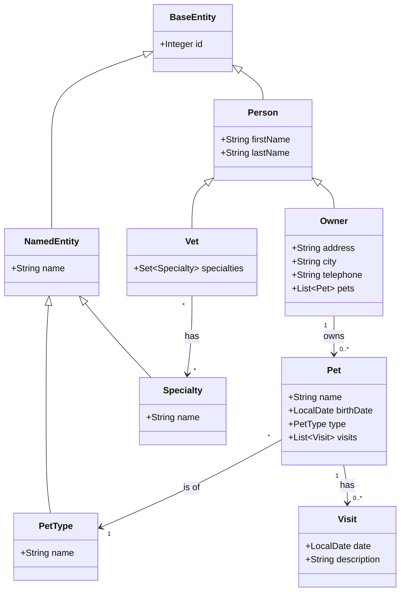

# Domain Model

Spring PetClinic models a veterinary clinic with five entity types. This page explains their relationships, JPA mapping decisions, and the constraints that shape application behaviour.

## Entity hierarchy

All entities extend `BaseEntity` (provides the `id` field). Named entities (those with a `name` field) extend `NamedEntity`. People extend `Person` (adds `firstName`, `lastName`).



## Database schema

The schema lives at `src/main/resources/db/h2/schema.sql` (and equivalents for MySQL and PostgreSQL). Key tables:

| Table | Maps to | Notes |
|-------|---------|-------|
| `owners` | `Owner` | `last_name` is `VARCHAR_IGNORECASE` in H2 |
| `pets` | `Pet` | FK to `owners`, FK to `types` |
| `types` | `PetType` | Read-only lookup; not editable via UI |
| `visits` | `Visit` | FK to `pets` |
| `vets` | `Vet` | — |
| `specialties` | `Specialty` | — |
| `vet_specialties` | — | Many-to-many join table |

## JPA mapping decisions

### Eager loading of pets

`Owner.pets` uses `@OneToMany(cascade = CascadeType.ALL, fetch = FetchType.EAGER)`. The owner detail page renders all pets and their visits in a single view — eager loading ensures everything is available without additional queries after the session closes (`spring.jpa.open-in-view=false`).

### Owner as aggregate root

Pets and visits are only ever modified through their owning `Owner`. `PetController` and `VisitController` both load `Owner` first, mutate its collections, then call `owners.saveAndFlush(owner)`. This keeps `Owner` as the aggregate root and avoids detached-entity problems.

### Unique pet names per owner

The `pets` table has a unique constraint:

```sql
ALTER TABLE pets ADD CONSTRAINT unique_owner_pet_name UNIQUE (owner_id, name);
```

`PetController` checks for duplicates at the application level first (via `owner.getPet(name, true)`), but also catches `DataIntegrityViolationException` in case of a race condition, checking that the exception message contains `unique_owner_pet_name` before rejecting the "name" field.

### Snake-case column mapping

`spring.jpa.hibernate.naming.physical-strategy=PhysicalNamingStrategySnakeCaseImpl` maps Java camelCase fields to snake_case columns automatically — `birthDate` → `birth_date`, `firstName` → `first_name`, etc.

### Batch fetch size

`spring.jpa.properties.hibernate.default_batch_fetch_size=16` batches collection fetches, reducing the number of SQL queries when multiple `Owner` records are loaded in a list view.

## See also

- [Request Flow and Spring MVC Patterns](./request-flow) — how controllers use these entities
- [HTTP Routes](../reference/routes) — URL structure reflecting the entity hierarchy
