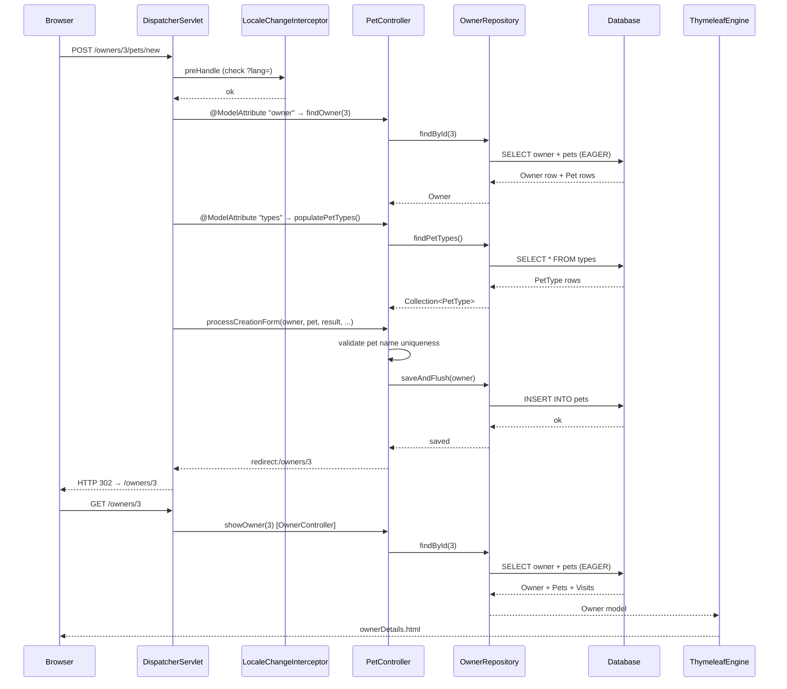

# Request Flow and Spring MVC Patterns

This page traces a complete HTTP request through Spring PetClinic, from the browser to the database and back, and explains the Spring MVC patterns used throughout.

## End-to-end request trace

The sequence below follows a `POST /owners/{ownerId}/pets/new` request (adding a pet) through every layer:



## Key patterns

### @ModelAttribute pre-population

Every handler method in `OwnerController` is preceded by `findOwner()`, annotated `@ModelAttribute("owner")`. When a path variable `{ownerId}` is present, it loads the `Owner` from the database. When absent (create form), it returns a new empty `Owner`. This pattern avoids repeating the owner-loading logic in every handler.

`PetController` does the same for both `owner` and `pet` model attributes, and additionally pre-populates the `types` list for the pet form dropdown.

### @InitBinder and field protection

Both `OwnerController` and `PetController` register an `@InitBinder` that calls `setDisallowedFields("id", "*.id")`. This prevents id fields from being bound from HTTP request parameters, closing a mass-assignment vector.

`PetController` additionally registers `PetValidator` via `dataBinder.setValidator(new PetValidator())` for the `pet` model attribute, which validates that the pet name and type are provided.

### PRG (Post/Redirect/Get) pattern

Every successful POST handler redirects rather than rendering a view directly:

```java
// PetController.processCreationForm
return "redirect:/owners/{ownerId}";
```

`RedirectAttributes.addFlashAttribute(...)` passes success messages across the redirect without polluting the URL. This prevents double-submission if the user presses the browser back button.

### Caching

`VetRepository` is annotated `@Cacheable("vets")` on both `findAll()` overloads. The `vets` cache is created by `CacheConfiguration` using the JCache API backed by Caffeine, with statistics enabled via JMX (`setStatisticsEnabled(true)`). Vets are cached because the list is read frequently and changes rarely compared to owner and pet data.

### Internationalization

`WebConfiguration` registers two beans:

- `SessionLocaleResolver` — stores the user's locale in the HTTP session; defaults to `Locale.ENGLISH`.
- `LocaleChangeInterceptor` — runs on every request and checks for a `lang` query parameter. If present, it updates the session locale. This is why `?lang=de` on any URL switches the entire UI to German immediately.

Messages are loaded from `src/main/resources/messages/messages_{lang}.properties`. Eleven locale files are present.

### Error handling

`CrashController` at `/oups` deliberately throws `RuntimeException`. Spring Boot's auto-configured error handling catches it and renders `src/main/resources/templates/error.html` via `BasicErrorController`. This route exists solely to demonstrate the error page.

## See also

- [Domain Model](./domain-model) — entity types used in this flow
- [HTTP Routes](../reference/routes) — all routes and their handlers
- [Configuration Properties](../reference/configuration) — i18n and caching configuration
