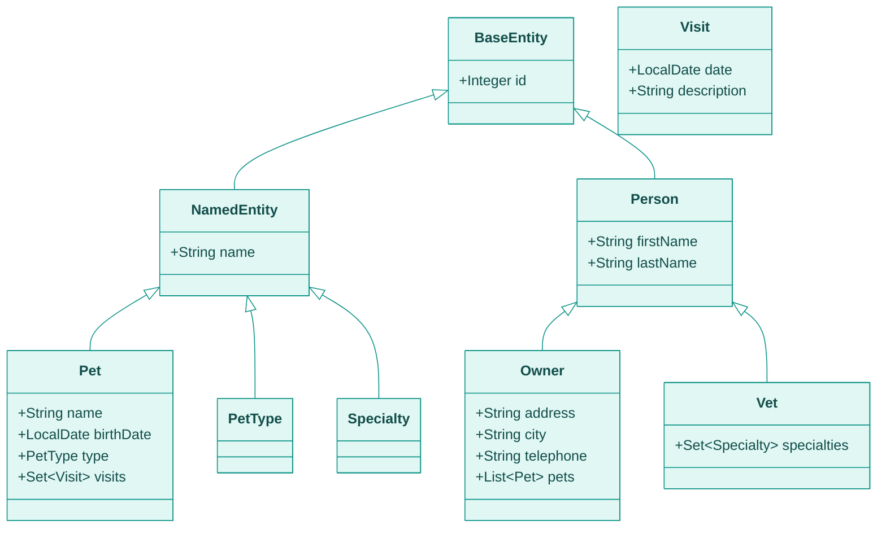

# Domain model

Entity classes, fields, constraints, and relationships for Spring PetClinic.

## Inheritance hierarchy

`BaseEntity` is a `@MappedSuperclass` — not a table itself; it contributes the `id` column to each concrete subclass table.

## Entities

### `BaseEntity`

Package: `org.springframework.samples.petclinic.model`

| Field | Type | Column | Notes |
|-------|------|--------|-------|
| `id` | `Integer` | `id` | Auto-generated identity; `@Id @GeneratedValue` |

### `NamedEntity` extends `BaseEntity`

Package: `org.springframework.samples.petclinic.model`

| Field | Type | Constraint | Notes |
|-------|------|-----------|-------|
| `name` | `String` | — | Inherited by `Pet`, `PetType`, `Specialty` |

### `Person` extends `BaseEntity`

Package: `org.springframework.samples.petclinic.model`

| Field | Type | Constraint | Notes |
|-------|------|-----------|-------|
| `firstName` | `String` | `@NotBlank`, `@Size(max=30)` | Maps to `first_name` (snake_case naming strategy) |
| `lastName` | `String` | `@NotBlank`, `@Size(max=30)` | Maps to `last_name`; stored as `VARCHAR_IGNORECASE` in H2 |

### `Owner` extends `Person`

Table: `owners` | Package: `org.springframework.samples.petclinic.owner`

| Field | Type | Constraint | Notes |
|-------|------|-----------|-------|
| `address` | `String` | `@NotBlank` | Maps to `address` |
| `city` | `String` | `@NotBlank` | Maps to `city` |
| `telephone` | `String` | `@NotBlank`, `@Pattern(regexp="\\d{10}")` | Exactly 10 digits; validation message key `telephone.invalid` |
| `pets` | `List<Pet>` | — | `@OneToMany(cascade=ALL, fetch=EAGER)`, ordered by `name ASC` |

### `Pet` extends `NamedEntity`

Table: `pets` | Package: `org.springframework.samples.petclinic.owner`

| Field | Type | Constraint | Notes |
|-------|------|-----------|-------|
| `name` | `String` | `@NotBlank` (via `PetValidator`) | Stored as `VARCHAR_IGNORECASE` in H2; `UNIQUE (owner_id, name)` |
| `birthDate` | `LocalDate` | Required (via `PetValidator`) | Format `yyyy-MM-dd`; error key `typeMismatch.birthDate` |
| `type` | `PetType` | Required for new pets (via `PetValidator`) | `@ManyToOne`; references `types` table |
| `visits` | `Set<Visit>` | — | `@OneToMany(cascade=ALL, fetch=EAGER)`, ordered by `visit_date ASC` |
| `owner_id` | FK → `owners.id` | — | Set via `Owner.pets` relationship |

**Unique constraint:** `UNIQUE (owner_id, name)` at the database level prevents two pets with the same name under the same owner. The constraint is case-insensitive in H2 (`VARCHAR_IGNORECASE`). `PetController` catches `DataIntegrityViolationException` and rejects the `name` field with error code `duplicate`.

### `PetType` extends `NamedEntity`

Table: `types` | Package: `org.springframework.samples.petclinic.owner`

| Field | Type | Notes |
|-------|------|-------|
| `id` | `Integer` | Auto-generated |
| `name` | `String` | Pet type label (cat, dog, hamster, etc.) |

Seed data in `db/{database}/data.sql` populates 6 types: bird, cat, dog, hamster, lizard, snake.

### `Visit` extends `BaseEntity`

Table: `visits` | Package: `org.springframework.samples.petclinic.owner`

| Field | Type | Constraint | Notes |
|-------|------|-----------|-------|
| `date` | `LocalDate` | Must be future | Default: tomorrow; error key `typeMismatch.visitDate` |
| `description` | `String` | `@NotBlank` | Free-text visit reason |
| `pet_id` | FK → `pets.id` | — | Set when creating a visit for a pet |

### `Vet` extends `Person`

Table: `vets` | Package: `org.springframework.samples.petclinic.vet`

| Field | Type | Constraint | Notes |
|-------|------|-----------|-------|
| `firstName` | `String` | `@NotBlank`, `@Size(max=30)` | |
| `lastName` | `String` | `@NotBlank`, `@Size(max=30)` | |
| `specialties` | `Set<Specialty>` | — | `@ManyToMany(fetch=EAGER)`, join table `vet_specialties` |

### `Specialty` extends `NamedEntity`

Table: `specialties` | Package: `org.springframework.samples.petclinic.vet`

| Field | Type | Notes |
|-------|------|-------|
| `id` | `Integer` | Auto-generated |
| `name` | `String` | Specialty label (dentistry, radiology, surgery) |

## Relationships

| From | To | Cardinality | Join / FK | Cascade | Fetch |
|------|----|------------|-----------|---------|-------|
| `Owner` | `Pet` | one-to-many | `pets.owner_id` | ALL | EAGER |
| `Pet` | `PetType` | many-to-one | `pets.type_id` | none | default |
| `Pet` | `Visit` | one-to-many | `visits.pet_id` | ALL | EAGER |
| `Vet` | `Specialty` | many-to-many | `vet_specialties` join table | none | EAGER |

## Validation

| Entity | Field | Rule | Source |
|--------|-------|------|--------|
| `Person` | `firstName` | not blank, max 30 chars | `@NotBlank @Size(max=30)` |
| `Person` | `lastName` | not blank, max 30 chars | `@NotBlank @Size(max=30)` |
| `Owner` | `address` | not blank | `@NotBlank` |
| `Owner` | `city` | not blank | `@NotBlank` |
| `Owner` | `telephone` | exactly 10 digits | `@Pattern(regexp="\\d{10}")` |
| `Pet` | `name` | not blank | `PetValidator` |
| `Pet` | `type` | required for new pets | `PetValidator` |
| `Pet` | `birthDate` | required | `PetValidator` |
| `Pet` | `name` | unique per owner | DB constraint + `DataIntegrityViolationException` |
| `Visit` | `description` | not blank | `@NotBlank` |
| `Visit` | `date` | must be future | `VisitController` explicit check |

## See also

- [Architecture](../concepts/architecture) — how entities move through the request lifecycle
- [HTTP endpoints](./endpoints) — which endpoints read and write each entity
