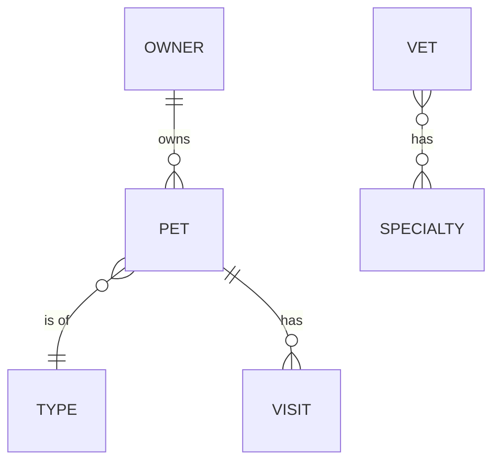

# Explore the App End to End

Walk through every domain entity in Spring PetClinic: owners, pets, visits, and veterinarians. By the end you will have created a full record and understand how the entities relate.

**Prerequisite:** the application is running at http://localhost:8080. See [Getting Started](../getting-started) if it isn't.

## Step 1 — Find an existing owner

Navigate to http://localhost:8080/owners/find.

Leave the search field blank and click **Find Owner** to list all owners. Results are paginated 5 per page. You can filter by last name prefix — `Da` matches Davis, Daneau, etc.

If exactly one owner matches, the app redirects directly to that owner's detail page.

## Step 2 — Add a new owner

1. Go to http://localhost:8080/owners/new.
2. Fill in all fields:
   - **First name** and **Last name**: required.
   - **Address** and **City**: required.
   - **Telephone**: exactly 10 digits (validated by `@Pattern(regexp = "\\d{10}")` on the `Owner` entity).
3. Click **Add Owner**.

On success, the app saves the owner and redirects to their detail page at `/owners/{id}`.

## Step 3 — Add a pet

From the owner detail page, click **Add New Pet**.

1. Enter a **Name**. Pet names must be unique per owner — the database enforces a `UNIQUE (owner_id, name)` constraint (`unique_owner_pet_name` in `db/h2/schema.sql`).
2. Enter a **Birth date**. Dates in the future are rejected.
3. Select a **Type** from the dropdown (cat, dog, lizard, snake, bird, hamster, or rabbit). These come from the `types` table, pre-populated by `db/h2/data.sql`.
4. Click **Add Pet**.

## Step 4 — Schedule a visit

From the owner detail page, find the pet you just added and click **Add Visit**.

1. Enter a **Date**. The date must be tomorrow or later — the form enforces `minVisitDate = LocalDate.now().plusDays(1)` set by `VisitController.minVisitDate()`.
2. Enter a **Description**.
3. Click **Add Visit**.

The visit appears in the pet's visit history on the owner detail page.

## Step 5 — View veterinarians

Navigate to http://localhost:8080/vets.html for the HTML view, or http://localhost:8080/vets for JSON.

Both endpoints use the same `VetController`. The HTML route (`/vets.html`) renders `vets/vetList.html` with pagination (5 per page). The JSON route (`/vets`) returns a `Vets` wrapper object and is cached via `@Cacheable("vets")` on `VetRepository.findAll()`.

## Step 6 — Switch the UI language

Append `?lang=de` to any URL to switch to German. Supported language codes:

| Code | Language |
|------|----------|
| `en` | English (default) |
| `de` | German |
| `es` | Spanish |
| `fa` | Persian |
| `hi` | Hindi |
| `ja` | Japanese |
| `ko` | Korean |
| `pt` | Portuguese |
| `ru` | Russian |
| `tr` | Turkish |

The language selection persists in the HTTP session via `SessionLocaleResolver` (configured in `WebConfiguration`). To revert: append `?lang=en`.

## What you explored

You created an Owner that owns a Pet that has a Visit. This mirrors the domain model:

See [Domain Model](../concepts/domain-model) for the full entity hierarchy and JPA mapping details.

## See also

- [Domain Model](../concepts/domain-model) — entity relationships and JPA decisions
- [Request Flow and Spring MVC Patterns](../concepts/request-flow) — what happens inside the app on each request
- [HTTP Routes](../reference/routes) — full route table
